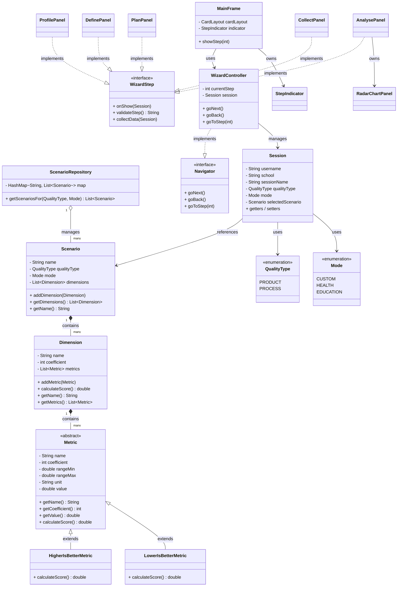
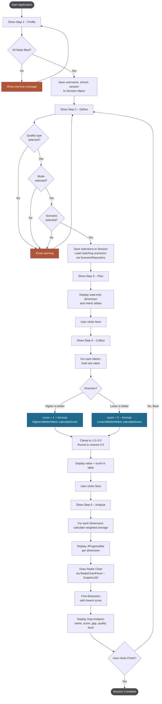

# Requirements & Design Document
## ISO 15939 Measurement Process Simulator

  
**Student:** Sıla Yıldız  
**Student ID:** 202328061  


## 1. Requirements

### 1.1 Functional Requirements

 Requirement 
* The application shall implement a 5-step wizard: **Profile → Define → Plan → Collect → Analyse** |
* Step 1 (Profile) shall collect username, school name, and session name. All fields are mandatory. If any field is empty, a user-friendly warning message shall be shown. |
* Step 2 (Define) shall allow selection of quality type (Product / Process), mode (Health / Education), and scenario. Each group shall enforce single selection using radio buttons. |
* The scenario list in Step 2 shall update dynamically based on the selected quality type and mode combination. |
* Step 3 (Plan) shall display the dimensions and metrics of the selected scenario in a **read-only** table. Columns: Metric, Coefficient, Direction, Range, Unit. |
* Step 4 (Collect) shall display raw metric values and automatically calculate a score (1–5) using the ISO 15939 formula. |
* Step 5 (Analyse) shall display: dimension-based weighted averages (via JProgressBar), a radar/spider chart (bonus), and gap analysis identifying the weakest dimension. |
* At least 2 modes must be defined; each mode must have at least 2 scenarios. |
* A step indicator at the top of the screen shall highlight the active step and show a check mark (✓) on completed steps. |
* The application shall allow backward navigation (Back button) to revisit and modify previous steps. |

### 1.2 Non-Functional Requirements

| Category | Requirement |
|----------|------------|
| Technology | Only Java SE 17+ and Java Swing shall be used. No external libraries are permitted. |
| Portability | The application shall be compilable and runnable from the command line via `javac` and `java` with no IDE dependency. |
| Usability | Validation messages shall be user-friendly and specify exactly which field or selection is missing. |
| Maintainability | Model and GUI classes shall be strictly separated (MVC). Code shall include meaningful comments. |
| Data | All scenario data shall be hard-coded inside Java classes. File reading is not required. |
| Version Control | The project shall be maintained in a public GitHub repository with a consistent commit history. |

### 1.3 Constraints

- Programming language: **Java SE 17 or higher**
- UI framework: **Java Swing only**
- No external libraries (only standard Java SE library)
- All scenario data must be defined as hard-coded values within Java classes
- Must be compilable and runnable via `javac` / `java` from the command line

---

## 2. Design

### 2.1 Architecture – MVC

The application follows the **Model-View-Controller (MVC)** architectural pattern, strictly separating data/logic, interface, and navigation into three packages.

| Package | Layer | Responsibility |
|---------|-------|----------------|
| `model/` | Model | Data classes, score calculation logic, hard-coded scenario data. Contains **no Swing imports**. |
| `view/` | View | All Swing panels, step indicator, and radar chart component. |
| `controller/` | Controller | Wizard navigation logic and step transition management. |

---

### 2.2 Package Structure

```
src/
├── Main.java
├── model/
│   ├── QualityType.java           (enum – Product / Process)
│   ├── Mode.java                  (enum – Custom / Health / Education)
│   ├── Metric.java                (abstract base class)
│   ├── HigherIsBetterMetric.java  (score = 1 + formula)
│   ├── LowerIsBetterMetric.java   (score = 5 − formula)
│   ├── Dimension.java             (holds list of metrics)
│   ├── Scenario.java              (holds list of dimensions)
│   ├── Session.java               (stores user selections)
│   └── ScenarioRepository.java    (all hard-coded scenario data)
├── controller/
│   ├── Navigator.java             (interface)
│   └── WizardController.java      (implements Navigator)
└── view/
    ├── WizardStep.java            (interface – onShow())
    ├── MainFrame.java             (main JFrame)
    ├── StepIndicator.java         (top bar with step states)
    ├── ProfilePanel.java          (Step 1)
    ├── DefinePanel.java           (Step 2)
    ├── PlanPanel.java             (Step 3)
    ├── CollectPanel.java          (Step 4)
    ├── RadarChartPanel.java       (bonus – radar chart)
    └── AnalysePanel.java          (Step 5)
```

---

### 2.3 Class Diagram



---

### 2.4 Activity Diagram



---

### 2.5 Class Descriptions

#### Model Classes

| Class | Description |
|-------|-------------|
| `Metric` | Abstract base class. Stores name, coefficient, range (min/max), unit, and raw value. Declares abstract method `calculateScore()`. |
| `HigherIsBetterMetric` | Extends `Metric`. Implements `calculateScore()` with formula: `1 + (value − min) / (max − min) × 4`. |
| `LowerIsBetterMetric` | Extends `Metric`. Implements `calculateScore()` with formula: `5 − (value − min) / (max − min) × 4`. |
| `Dimension` | Holds an `ArrayList<Metric>`. Calculates dimension score as a weighted average of its metrics. |
| `Scenario` | Holds an `ArrayList<Dimension>`. Has name, `QualityType`, and `Mode`. |
| `Session` | Stores all user selections across wizard steps: profile data, selected quality type, mode, and scenario. |
| `ScenarioRepository` | Contains all 8 hard-coded scenarios. Uses a `HashMap` to map `(qualityType_mode)` keys to scenario lists for O(1) lookup. |
| `QualityType` | Enum with constants: `PRODUCT`, `PROCESS`. |
| `Mode` | Enum with constants: `CUSTOM`, `HEALTH`, `EDUCATION`. |

#### Controller Classes

| Class | Description |
|-------|-------------|
| `Navigator` | Interface defining navigation contract: `goNext()`, `goBack()`, `goToStep(int)`. |
| `WizardController` | Implements `Navigator`. Manages current step index, calls `validateStep()` before advancing, triggers `CardLayout` transitions. |

#### View Classes

| Class | Description |
|-------|-------------|
| `WizardStep` | Interface every step panel implements: `onShow(Session)`, `validateStep()`, `collectData(Session)`. |
| `MainFrame` | Top-level `JFrame`. Hosts `StepIndicator`, a `CardLayout` panel, and Back/Next navigation buttons. |
| `StepIndicator` | Custom-painted `JPanel` using `Graphics2D`. Shows numbered circles; completed steps show ✓, active step is highlighted. |
| `ProfilePanel` | Step 1 – Collects username, school, session name. Validates all fields are non-empty. |
| `DefinePanel` | Step 2 – Three radio-button groups for quality type, mode, and scenario. Scenario list rebuilds dynamically on selection changes. |
| `PlanPanel` | Step 3 – Read-only scrollable table showing dimensions and metrics of the selected scenario. |
| `CollectPanel` | Step 4 – Displays raw values and colour-coded scores (green ≥ 4.0, yellow ≥ 2.5, red < 2.5). |
| `RadarChartPanel` | Bonus – Draws a radar/spider chart using `Graphics2D`. No external libraries. |
| `AnalysePanel` | Step 5 – Shows dimension `JProgressBar`s, embeds `RadarChartPanel`, and displays the gap analysis card. |

---

### 2.6 OOP Principles Applied

| Principle | Application in This Project |
|-----------|----------------------------|
| **Inheritance** | `HigherIsBetterMetric` and `LowerIsBetterMetric` both extend the abstract `Metric` class, inheriting common fields and providing their own `calculateScore()` implementation. |
| **Polymorphism** | `calculateScore()` behaves differently depending on the concrete subclass. A `Dimension` holds a `List<Metric>` and calls `calculateScore()` on each without knowing which subclass it is. |
| **Encapsulation** | All model fields are `private` or `protected`, accessed only through public getters/setters. GUI panels never access model data directly. |
| **Abstraction** | The abstract `Metric` class hides the formula implementation. The `WizardController` calls `WizardStep` methods without knowing which panel is active. |
| **Interfaces** | `Navigator` defines navigation contract. `WizardStep` defines panel contract. Concrete classes are decoupled through these interfaces. |

---

### 2.7 Score Calculation Formula

```
Higher is better  →  score = 1 + (value − min) / (max − min) × 4
Lower is better   →  score = 5 − (value − min) / (max − min) × 4

Result is clamped to [1.0 – 5.0] and rounded to nearest 0.5
```

**Dimension weighted average:**

```
dimensionScore = Σ (metricScore_i × metricCoeff_i) / Σ metricCoeff_i
```

**Quality level labels (Gap Analysis):**

| Score | Level |
|-------|-------|
| ≥ 4.5 | Excellent |
| ≥ 3.5 | Good |
| ≥ 2.5 | Needs Improvement |
| < 2.5 | Poor |

---

### 2.8 Collections Usage

| Collection | Used In | Purpose |
|-----------|---------|---------|
| `ArrayList<Metric>` | `Dimension` | Stores the list of metrics belonging to a dimension |
| `ArrayList<Dimension>` | `Scenario` | Stores the list of dimensions belonging to a scenario |
| `ArrayList<Scenario>` | `ScenarioRepository` | Master list of all hard-coded scenarios |
| `HashMap<String, List<Scenario>>` | `ScenarioRepository` | Maps composite key (`qualityType_mode`) to matching scenarios for O(1) lookup |

---


